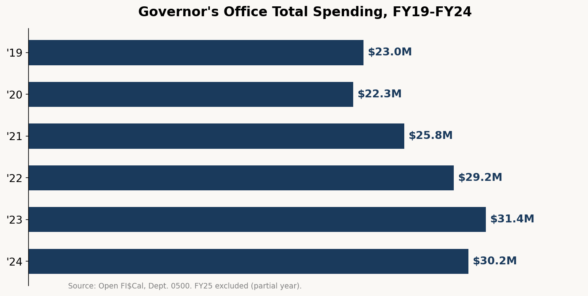
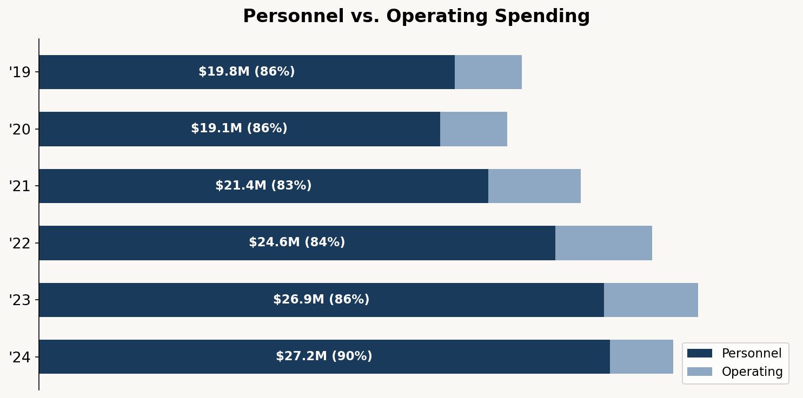
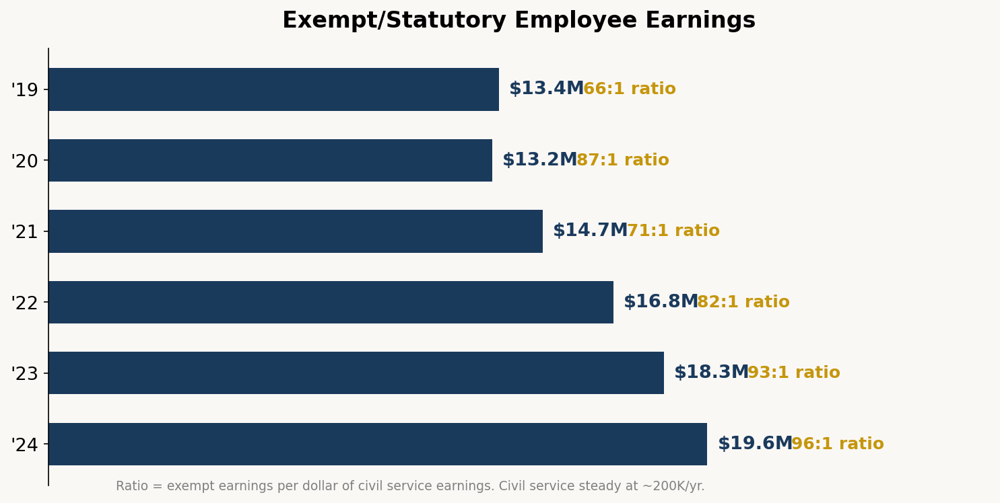
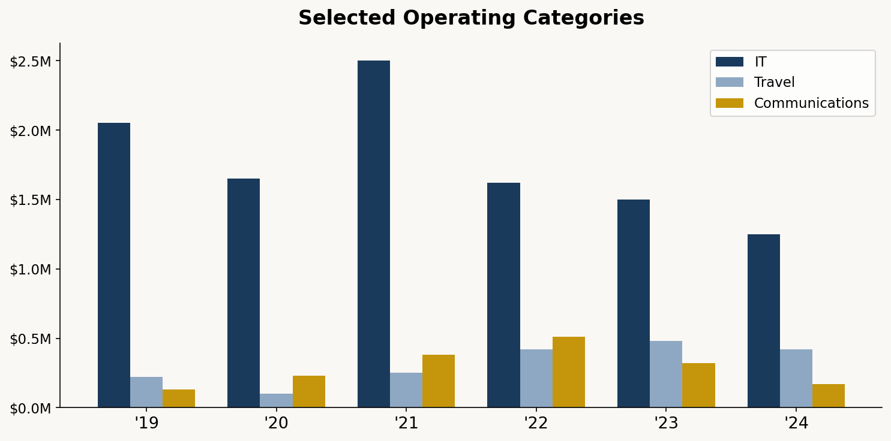

# What the Governor's Checkbook Tells Us

## California Counts: Poking around Open FI$Cal so you don't have to

I've been spending evenings poking around [Open FI$Cal](https://open.fiscal.ca.gov/), California's financial transparency portal. This is one of the genuinely underappreciated things the state has built in recent years: a public checkbook covering 79% of state expenditures, updated monthly, downloadable in bulk. The kind of civic infrastructure that makes accountability possible. And also the kind of thing almost nobody looks at.

So I looked at it. Specifically, at Department 0500: the Governor's Office.

Not the entire executive branch. Not CalTrans or the prison system or the UC system. Just the office itself, the nerve center of California governance. Seven fiscal years of spending data, FY19 through FY25, about 15,000 individual line items. What follows is a first pass at what the numbers show.

---

## The Topline: A 31% Expansion

Governor's Office total spending grew from $23 million in FY19 to $30.2 million in FY24. That's a 31% increase over five years. (FY25 data is partial, so I'm setting it aside.) For context, cumulative California CPI over that same window was roughly 22-25%. The office outpaced inflation, though not dramatically.

But the interesting story isn't the total. It's the composition.

---

## A Personnel Shop

The Governor's Office is, above all, a people operation. Personnel costs (salaries, wages, benefits) consumed 86% of the budget in FY19 and rose to 90% by FY24. Operating expenses actually *fell* from $3.2 million to $2.6 million, even as the office grew.

Where the money goes: exempt and statutory employee earnings, which is to say the political appointees and senior staff, not the civil service lifers. Exempt employee pay totaled $13.4 million in FY19 and $19.6 million by FY24, a 45% jump. Meanwhile, permanent civil service earnings barely moved, hovering around $200,000 across all seven years.

That ratio is striking. For every dollar the Governor's Office spent on civil service salaries, it spent roughly 66 times more on exempt positions in FY19. By FY24, that ratio had climbed to 96 to 1.

This is consistent with the [CalMatters reporting](https://calmatters.org/politics/capitol/2025/01/gavin-newsom-spending-california-trump/) that the Governor's Office grew from 150 employees in late 2018 to 381 by the end of 2024. The office more than doubled in headcount, and it did so almost entirely through exempt positions, the political appointees who serve at the pleasure of the governor. The civil service footprint barely changed.

---

## The Staffing Question

There are at least two ways to read this.

The critical read is straightforward: the Governor built a large personal staff at taxpayer expense during a period of surging revenues, then found himself talking about efficiency when the money tightened. There's a real irony in citing the Office of Data and Innovation as your version of DOGE when your own office's salary line grew 41% in five years.

The more generous read is that a modern governor, especially one facing pandemic response, wildfires, a federal government actively hostile to California's interests, and a housing crisis, genuinely needs more staff. A unit dedicated to "land use and climate innovation" might be exactly the kind of in-house operational capacity the state has been missing for decades. The question isn't whether 381 people is too many to run the fifth-largest economy in the world. The question is whether those 381 people are working on the right things, and whether the results justify the investment.

The data can't answer that second question. But it can tell us where the money goes besides salaries.

---

## The Operating Budget: Where the Cuts Landed

Operating expenses peaked at $4.6 million in FY22 and dropped to $2.6 million by FY24. That's a 44% operating cut even as personnel costs continued rising. A few line items tell the story.

IT spending fell from $2 million in FY19 to $1.2 million in FY24, a 39% decline. This is odd for an office that claims to be modernizing government through data and innovation. You can't digitally transform much while cutting your technology budget by two-fifths.

Travel roughly doubled from $220,000 in FY19 to $420,000 in FY22-FY24. More staff traveling for an office that's more than twice as large isn't surprising. On a per-capita basis, travel spending per employee may have actually decreased.

Training spending tells a curious story. It was negligible in most years ($2,000 to $11,000) except for FY22, when it spiked to $420,000. What happened in FY22? If you know, I'd love to hear.

Dues and memberships is a small but interesting line: $263,000 in FY19, then a collapse to $13,000 in FY24. I don't know what memberships the Governor's Office was paying for or why they stopped, but that's a 95% cut.

---

## What the Data Doesn't Show

A few important caveats. Open FI$Cal data is unaudited. It represents accounting transactions, not approved budgets. The Governor's Office authorized budget for FY24-25 was $32.5 million, but actual recorded spending was $30.2 million, which is typical for the gap between authorization and expenditure.

More importantly, the data doesn't tell us what these people *do*. It can't distinguish between a policy advisor working on permitting reform and one working on press strategy. It can't measure outcomes. We know the office spent $19.6 million on exempt employee salaries in FY24, but we don't know whether that bought competent governance or just more bodies.

That's the fundamental limitation of financial transparency data. It's necessary but not sufficient. You can see the inputs but not the outputs. The checkbook shows you who got paid but not what they delivered.

---

## The Civic Data Argument

I'm writing this as a test case for a broader argument: that California's open data infrastructure, while imperfect, is genuinely usable for civic accountability. Open FI$Cal exists because Government Code section 11862 requires it. The data is machine-readable, downloadable, and reasonably well-structured. A few hours with Python and you can produce the analysis above.

That's not nothing. Most states would kill for this. California ranked dead last in the US PIRG financial transparency rankings in 2016 and has come a long way since.

But the infrastructure works only if people actually use it. The data has been sitting there for years. The Governor's Office spending trajectory has been publicly available the entire time. CalMatters did excellent reporting on the staffing expansion using payroll data from the State Controller's Office, a different dataset. I'm using Open FI$Cal expenditure data, which tells a complementary story about where the money flows.

The dream, of course, is that this becomes routine. Not one person poking around on evenings and weekends but a standing practice of data-informed civic oversight. The machines are getting good enough to help. The data is there. What's missing is the habit.

---

*Data source: [Open FI$Cal](https://open.fiscal.ca.gov/), California's financial transparency portal. Department 0500, Governor's Office, FY19 through FY25. Analysis performed in Python. All figures are unaudited expenditure data.*

*This is the first installment of California Counts, a series using California's open data to ask questions about how the state spends your money. Got a dataset you want me to look at? Get in touch.*
