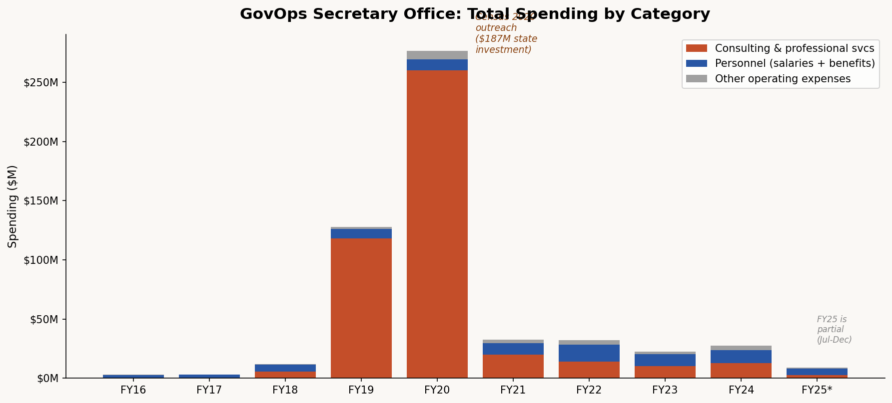
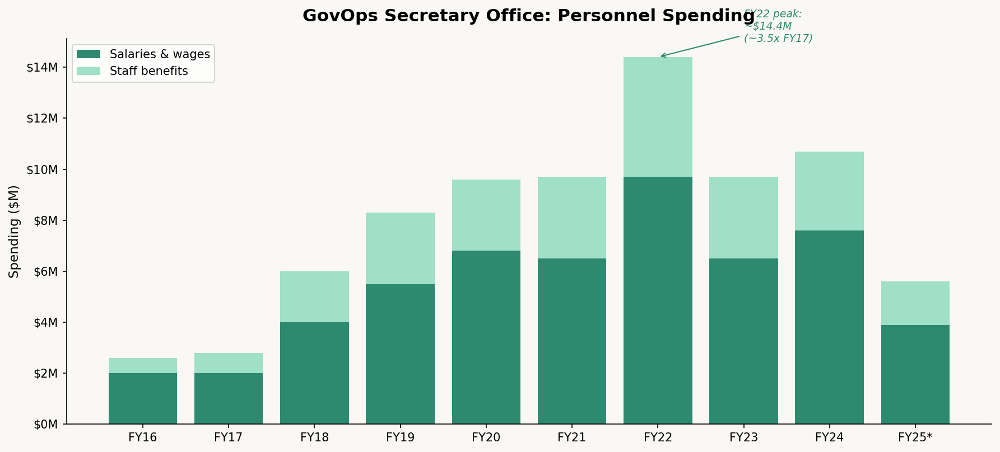
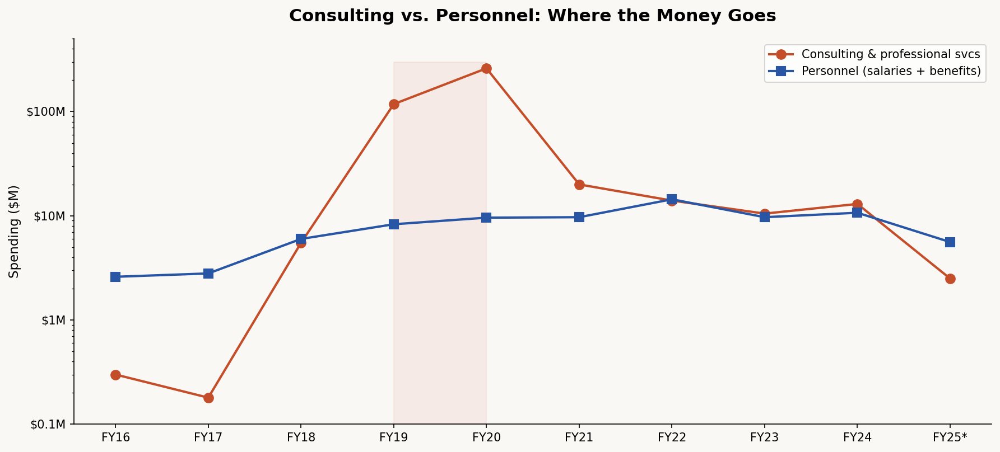

# California Counts: Inside the Back Office
## What a decade of GovOps spending data reveals about who actually runs state government

Most Californians have never heard of Department 0511. It doesn't run a prison or a hospital or a highway system. It's the Secretary of the Government Operations Agency, the office responsible for procurement, IT, human resources, and the operational machinery that makes state government function. The plumbing. The part of government that makes government work, or at least is supposed to.

Ten years of spending data from Open FI$Cal, California's expenditure transparency portal, tell an unexpected story. Not a story about waste or scandal, but a story about how California actually musters capacity when it decides something matters. And what happens afterward.

---

The first thing you notice is the shape of the curve.

In FY2016 and FY2017, the GovOps Secretary's office spent about $3 million a year. Almost all of it was personnel. This was a lean coordinating body. Marybel Batjer, the inaugural agency secretary appointed by Jerry Brown in 2013, ran a tight ship. The office existed to oversee, not to operate.

Then the line goes vertical.

By FY2019, spending hit $128 million. By FY2020, it reached $277 million. A quiet coordinating office had become, briefly, one of the largest spending operations in state government. The total across those two fiscal years alone: over $400 million.

What happened? The Census.

California invested $187.2 million in outreach for the 2020 Census, more than any other state by a wide margin. That money flowed through GovOps, which housed the California Complete Count Office. The spending data tells the story in granular detail. Individual line items for $50 million and $100 million in external consulting contracts. Mercury Public Affairs received $46 million for the statewide media campaign. Community-based organizations across the state's ten Census regions received grants to reach hard-to-count populations in dozens of languages.

The logic was blunt and persuasive: an undercount would cost California roughly $1,000 per person per year in federal funding, plus potentially a Congressional seat. The 1990 Census had missed 2.7 percent of California's population, costing the state an estimated $2 billion and likely a seat in the House. Leaders were not going to let it happen again.

It worked. California's final self-response rate hit 69.6 percent, beating the national average and improving on the state's 2010 performance despite COVID-19 upending the door-to-door canvassing effort midway through. A PPIC analysis found that California's count of Latinos, African Americans, and children was better than almost any other state.

---

But look at the composition of that spending. Of the $437 million in total consulting and professional services across the decade, the vast majority is categorized simply as "Consult & Prof Svcs Extern Oth." That's $415 million in a single line item description. The data tells you how much was spent, but not on whom or for what specific purpose, beyond the broadest category. This is the limitation of Open FI$Cal: it provides transparency at the accounting level, not the operational level. You can see the checks being cut. You can't see the work being done.

This gap matters because of what the spending data reveals about the office's ongoing structure. After the Census surge receded, GovOps didn't return to its $3 million baseline. It settled into a new steady state of roughly $25 to $33 million per year. Personnel spending, which had tripled from $2.6 million in FY2016 to about $9.6 million by FY2020, stayed elevated. It even spiked to $14.4 million in FY2022 before settling around $10-11 million. The office had grown, and it wasn't shrinking back.

The reason is a genuine expansion of mission. In 2019, the Newsom administration created the Office of Digital Innovation within GovOps with a $36 million first-year budget. In 2022, ODI merged with CalData and the Government Excellence and Transformation Center to form the Office of Data and Innovation, now responsible for the state's Chief Data Officer, the California Design System, CalAcademy training, and a growing portfolio of data projects with departments ranging from Housing and Community Development to the Division of Drinking Water.

A "Data and Innovation Services Revolving Fund" was established, receiving $20 million in FY2022-23. The spending data shows this fund in action: expense transfers of $22 million in FY22 and $6.5 million in FY23, mostly flowing out to IT and consulting services. ODI is doing real work. It built the covid19.ca.gov website. It created data pipelines for CalHR that compressed a years-long improvement process into four months. It partnered with the Department of Toxic Substances Control on community engagement pilots that increased public comments by 600 percent.

---

Here is the tension at the heart of this data, though.

Even in its steady state, the GovOps Secretary's office spends roughly as much on consulting and professional services as it does on its own staff. In the FY2022 through FY2024 period, consulting averaged $12.7 million per year against $7.9 million in salaries and $3.6 million in benefits. The office that exists to make state government more capable, more innovative, more technologically adept, relies on external contractors for nearly half its work.

Government consulting serves real purposes. Specialized skills on short timelines. Surge capacity for one-time efforts like the Census. Expertise that state salary bands can't attract permanently. But the pattern is worth naming because it runs directly counter to the office's own stated mission. GovOps is supposed to be building state capacity. Yet its own spending structure embodies the opposite model: a thin layer of permanent staff managing a rotating cast of contracted specialists.

Governor Newsom, in a moment of rhetorical flair, called ODI "our DOGE," drawing a parallel to the federal Department of Government Efficiency. The comparison is more interesting than he probably intended. DOGE is a wrecking ball aimed at the administrative state. ODI is an attempt to build something inside it. The question the spending data raises is whether ODI's model, which itself relies heavily on consulting dollars, can produce the durable institutional capability that California needs. Or whether it's another initiative that looks like capacity-building but functions as project-based contracting with a government logo.

---

Nick Maduros, a Yale and Harvard Law grad who spent eight years running the Department of Tax and Fee Administration, took over as GovOps Secretary in March 2025. At CDTFA he cut the cost to administer a dollar of revenue by 28 percent while improving taxpayer service. His mandate at GovOps is procurement reform, hiring streamlining, and IT modernization. In a recent Senate Rules Committee appearance, he expressed frustration with the pace of state technology, noting that Ukraine, in the middle of a war, delivers better digital services than California does 65 miles from Silicon Valley.

The spending data suggests both the opportunity and the challenge. The opportunity: GovOps has genuinely expanded its ambitions beyond pure coordination. It now houses real operational capabilities in data, design, and digital services. The challenge: the financial structure of that capability is still heavily outsourced. A $28 million annual operation that spends nearly half its budget on consulting is not yet an institution. It's a project management office with aspirations.

California can muster extraordinary capacity when it decides to, as the $187 million Census investment proved. The question is whether it can sustain that capacity without the crisis. Whether the data pipelines and design systems and innovation fellowships will accrete into genuine institutional muscle, or whether they'll remain line items in a consulting budget, vulnerable to the next round of cuts.

The numbers, at least, are public. That's a start.

---

*This is the third installment of California Counts, a data journalism series exploring California state spending using Open FI$Cal data. Previous posts examined the Governor's Office and the GovOps Secretary. All data and analysis available on request.*

*Data source: [Open FI$Cal](https://open.fiscal.ca.gov/), California's financial transparency portal. Department 0511, GovOps Secretary, FY16 through FY25. Analysis performed in Python. All figures are unaudited expenditure data.*
