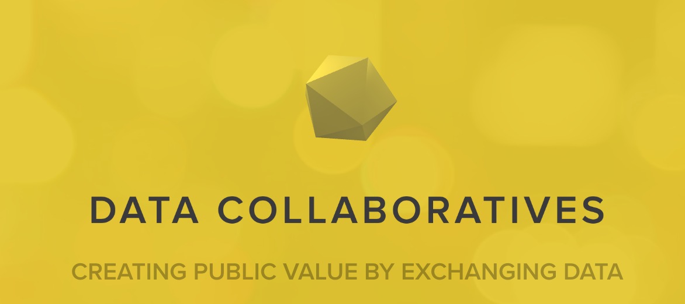

# Data Collaboratives

H/T [NYU GovLab Data Collaboratives](http://datacollaboratives.org/)

Mapping public data collaborations in California and beyond. The goal is to build on existing efforts mapping public data (and related) collaborations across the globe including:

- [NYU Gov Lab Data Collaboratives](http://datacollaboratives.org) — (from 2015-16)
- [Apolitical Global Innovation Labs](https://apolitical.co/government-innovation-lab-directory/)
- [Gov Ex Data Standards Directory](http://datastandards.directory/)

## The California Data Collaborative: A Worked Example

The California Data Collaborative (CaDC) is a working proof of concept for what a "data utility" might look like. Co-founded as a data collaborative serving public water agencies, CaDC grew from an MVP to ~$1MM ARR SaaS platform — demonstrating that public agencies will pay for shared data infrastructure when it solves real operational problems.

The CaDC model embodies several of the [[public-tech-principles|Public Technology Principles]]:
- **Aggregating demand** across agencies to build shared infrastructure
- **Stewarding public data** with skilled technologists
- **Standardizing datasets** critical to basic public services
- **Including the community** in ongoing design and maintenance

## List of Public Data Collaborations

| Project Title | Type of Data Collaboration | Notes |
|---|---|---|
| [UCLA Policy Lab](https://www.capolicylab.org/) | Data warehousing, streamlining research | |
| [SCAG Regional Data Collaborative](https://datadonuts.la/event/data-donuts-12.html) | Inter-governmental partnership | |
| [Berkeley Water Data Collaborative](https://data.berkeley.edu/news/data-collaboratives-moving-knowledge-action) | Aggregating projects from Water Data Challenges and beyond | |
| [California Data Collaborative](http://californiadatacollaborative.org) | Data warehousing, decision support analytics, streamlining research, curating open data, inter-governmental partnership | |
| [Mobility Data Specification](https://github.com/CityOfLosAngeles/mobility-data-specification) | Data Standard | |

## Contribute

This is a living document! Please feel free to submit a PR to improve the list of California data collaborations. If you're not familiar with GitHub please feel free to submit additional data collaboratives via [this google form](https://docs.google.com/forms/d/e/1FAIpQLSft6Y9cwcgLRAHCzCgHRJrABGoDq5JbRl-BDctjuy5JwtEL-Q/viewform?usp=sf_link).

## Future Work

In the future it would be useful to survey key project metadata including a list of partners, number of staff dedicated to the collaboration, the annual budget of the project, and other useful contextual information.

---

*See also: [[public-tech-principles|Public Technology Principles]] for the policy framework, and [[california-counts/index|California Counts]] for data-driven analyses of California government spending.*
